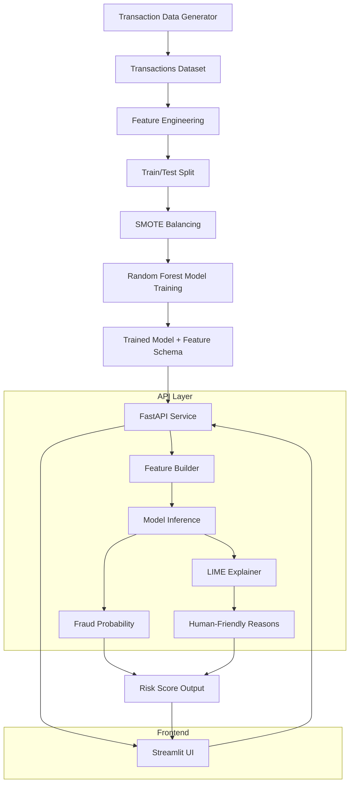

# M-PESA Transaction Anomaly Scorer

A production-style fraud detection system built on Kenya's M-PESA mobile money ecosystem. Combines a Random Forest classifier, SMOTE-based class balancing, LIME explainability, and a FastAPI + Streamlit stack into a deployable ML pipeline.

**Live demo:** [mpesa-guard.streamlit.app](https://mpesa-guard.streamlit.app)

---

## What This Does

Mobile money fraud in East Africa is a real and growing problem. This system simulates a fraud intelligence pipeline that a fintech or financial institution could use to:

- Score incoming transactions for fraud probability in real time
- Explain *why* a transaction was flagged, in human-readable terms
- Classify risk level as Low, Medium, or High
- Serve predictions via API or a browser-based dashboard

The project is built around M-PESA transaction patterns, including time-of-day behaviour, transaction amounts, user deviation signals, and transaction type, because fraud detection that ignores local context misses the actual threat surface.

---

## Architecture



---

## Dataset and Model Performance

| Metric | Value |
|---|---|
| Dataset size | 10,000 transactions |
| Base fraud rate | 3% (realistic for mobile money) |
| After SMOTE balancing | 23% fraud rate, 10,088 rows |
| Algorithm | Random Forest |
| Accuracy | 100% |
| ROC-AUC | 1.0 |

**Honest note on the metrics:** The model achieves perfect scores on the test set. This is expected and intentional, given the synthetic dataset and controlled fraud simulation logic. The primary goal of this project is the system architecture, the explainability layer, and the end-to-end ML pipeline, not production model generalisation. Replacing synthetic data with real transaction data would introduce noise that tests the model's true robustness. That is the intended next step.

---

## Explainability (LIME)

Every prediction includes a human-readable explanation of the contributing factors:

```json
[
  {"reason": "Unusual nighttime transaction", "impact": 0.31},
  {"reason": "High transaction amount", "impact": 0.02}
]
```

This matters in financial services because regulators and end users need to understand *why* a transaction was flagged, not just that it was.

---

## Stack

- **ML:** scikit-learn, imbalanced-learn (SMOTE), LIME
- **Backend:** FastAPI, Uvicorn
- **Frontend:** Streamlit
- **Data:** Synthetic M-PESA transaction generator (custom)

---

## Project Structure

```
M-PESA-Transaction-Anomaly-Scorer/
├── data/                  # Data generation scripts and transaction dataset
├── ml/                    # Model development scripts and trained model artifacts (fraud_model.pkl, feature_columns.pkl)
├── notebooks/             # Exploratory analysis  notebooks
├── ui/                    # Streamlit frontend
├── app.py                 # FastAPI backend
├── requirements.txt
└── README.md
```

---

## Running Locally

```bash
# 1. Clone and set up environment
git clone https://github.com/melisamichuki01/M-PESA-Transaction-Anomaly-Scorer.git
cd M-PESA-Transaction-Anomaly-Scorer
python -m venv fraud_venv
source fraud_venv/bin/activate  # Windows: fraud_venv\Scripts\activate

# 2. Install dependencies
pip install -r requirements.txt

# 3. Generate data
python data/generate_data.py

# 4. Start FastAPI backend
uvicorn app:app --reload

# 5. Run Streamlit frontend (separate terminal)
streamlit run ui/app_streamlit.py
```

API endpoints:
- `POST /score` — fraud probability
- `POST /score_explain` — probability + LIME explanation

---

## What's Next

- Replace synthetic data with anonymised real transaction samples
- Swap LIME for SHAP for richer feature attribution
- Add drift detection for production monitoring
- Deploy FastAPI backend on Render or Railway
- Add an authentication layer for multi-user API access
- Persistent prediction logging and audit trail

---

## About

Built by [Melisa Michuki](https://github.com/melisamichuki01), AI and data consultant based in Nairobi, Kenya. Part of her applied ML portfolio focused on East African data contexts.
