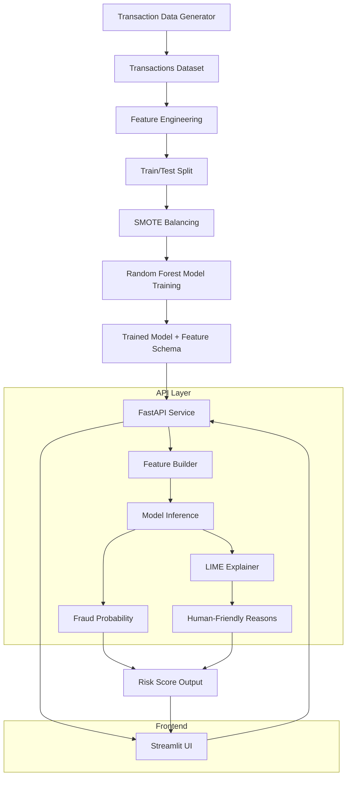

# 📊 M-PESA Transaction Anomaly Scorer (Fraud Lab)

A machine learning system that detects fraudulent M-PESA transactions using synthetic data, explainable AI (LIME), and a FastAPI + Streamlit stack.


## 🚀 Project Overview

This project simulates real-world mobile money fraud detection using:

* Synthetic M-PESA transaction data generator
* Feature engineering pipeline
* Random Forest classifier
* SMOTE for class imbalance handling
* LIME for explainable AI
* FastAPI backend (scoring + explanations)
* Streamlit frontend (user-friendly fraud dashboard)


## 🧠 Architecture Flow




## 📁 Project Structure

```
M-PESA-Transaction-Anomaly-Scorer/
│
├── data/
│   ├── generate_data.py
│   └── transactions.csv
│
├── models/
│   ├── fraud_model.pkl
│   └── feature_columns.pkl
│
├── train_model.py
├── app.py                  # FastAPI backend (current working version)
├── app_streamlit.py       # Frontend UI
├── test_model.py
└── README.md
```


## ⚙️ Installation

### 1. Create virtual environment

```bash
python -m venv fraud_venv
source fraud_venv/bin/activate   # Mac/Linux
fraud_venv\Scripts\activate      # Windows
```

### 2. Install dependencies

```bash
pip install -r requirements.txt
```

If building manually:

```bash
pip install fastapi uvicorn pandas numpy scikit-learn imbalanced-learn joblib lime streamlit requests matplotlib seaborn
```


## 🧪 Step 1: Generate Data

```bash
python data/generate_data.py
```

Outputs:

```
data/transactions.csv
```


## 🧠 Step 2: Train Model

```bash
python train_model.py
```

Outputs:

```
ml/fraud_model.pkl
ml/feature_columns.pkl
```


## 🚀 Step 3: Run FastAPI Backend

```bash
uvicorn app:app --reload
```

Endpoints:

* `POST /score` → fraud probability only
* `POST /score_explain` → probability + LIME explanation


## 💻 Step 4: Run Streamlit UI

```bash
streamlit run app_streamlit.py
```


## 🔍 Explainability (LIME)

Each prediction returns:

* Feature contributions
* Human-readable reasons
* Risk interpretation layer

Example:

```json
[
  {"reason": "Unusual nighttime transaction", "impact": 0.31},
  {"reason": "High transaction amount", "impact": 0.02}
]
```


## 🧪 Model Details

* Algorithm: Random Forest
* Balancing: SMOTE (30% fraud oversampling)
* Features:

  * Transaction amount
  * Time features (hour, day)
  * Behavioral signals
  * Transaction type encoding
  * User deviation metrics


## 🎯 Key Features

* Realistic fraud simulation logic
* Explainable predictions (LIME)
* Risk-level classification (Low / Medium / High)
* Streamlit “Fraud Lab” UI
* API-first architecture


## 🧩 Future Improvements

* Replace LIME with SHAP (optional hybrid explainability)
* Add real-time streaming ingestion
* Deploy on Render / Railway
* Add authentication layer
* Store predictions in database
* Drift detection module


## ⚠️ Notes

* Model is trained on synthetic data (not production-safe yet)
* Feature alignment between training and inference is critical
* `transaction_type` must always match training schema


## 💡 Philosophy

This project is built as a **learning-first fraud intelligence lab**, not just a classifier — focusing on:

* interpretability
* system design
* real-world ML pipelines


